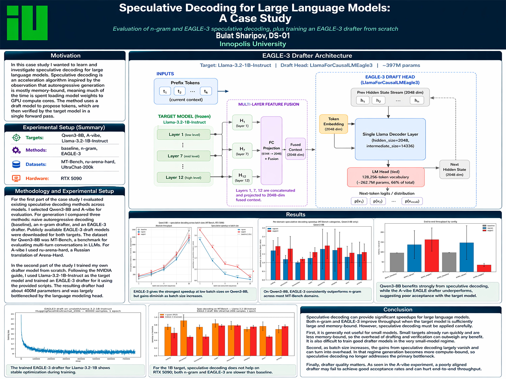

# Speculative Decoding Case Study

**Project Poster** file is `project_poster.pdf`



## Speculative Decoding Evaluation

Per-prompt wall-clock comparison of three decoding methods — vanilla autoregressive, n-gram prompt-lookup (PLD), and EAGLE-3 — against Qwen3-8B on MT-Bench (EN) and A-Vibe on ru-arena-hard (RU). 

### Configs

| Name | Target | Drafter | Dataset |
|---|---|---|---|
| `qwen_baseline` | Qwen3-8B (bf16) | — | MT-Bench |
| `qwen_ngram`    | Qwen3-8B (bf16) | n-gram (PLD, min=2, max=4) | MT-Bench |
| `qwen_eagle3`   | Qwen3-8B (bf16) | `AngelSlim/Qwen3-8B_eagle3` | MT-Bench |
| `avibe_baseline`| A-Vibe (fp16)   | — | ru-arena-hard |
| `avibe_ngram`   | A-Vibe (fp16)   | n-gram (PLD, min=2, max=4) | ru-arena-hard |
| `avibe_eagle3`  | A-Vibe (fp16)   | `AvitoTech/avibe-eagle` | ru-arena-hard |

All: `batch=1`, `temperature=0`, `max_tokens=512`, `min_tokens=128`, `num_speculative_tokens=5`. First 3 prompts per config are warmup and discarded.

### Setup

```bash
pip install -r requirements.txt
```

vLLM must be `>=0.10` built against CUDA 12.8+ for Blackwell (RTX 5090). If flash-attn fails to import on Blackwell, fall back to xFormers:

```bash
export VLLM_ATTENTION_BACKEND=XFORMERS
```

### Run everything

```bash
bash scripts/run_all.sh
```

This runs all six configs sequentially (5 s GPU drain between them) and then invokes `python analyze.py`. A single config:

```bash
bash scripts/run_one.sh qwen_eagle3
```

### Outputs

- `results/<config>.csv` — per-prompt `wall_s`, `out_tokens`, `tok_per_s`. One row per prompt, flushed after every generation, so a crash 40 prompts in isn't a total loss.
- `plots/speedup_by_domain.png` — **speedup by MT-Bench category for Qwen3-8B only** (A-Vibe is omitted: ru-arena clusters are not summarized in this figure). n-gram vs EAGLE-3, baseline at 1.0, std error bars. Rebuild with `python analyze.py`.
- `plots/throughput.png` — aggregate tokens/sec per config (6 bars), colored by method family. The "how much faster overall" view.

## Training experiment

Trains an EAGLE-3 draft head for `unsloth/Llama-3.2-1B-Instruct` (ungated mirror of `meta-llama/Llama-3.2-1B-Instruct`) on 80k samples from `HuggingFaceH4/ultrachat_200k` for 1 epoch, then benchmarks it against both the vanilla baseline and vLLM's built-in n-gram prompt-lookup on MT-Bench.


```bash
bash scripts/run_training.sh
```

Outputs:

- `eagle_out/` — HF artefact from the Trainer (composed model + tokenizer).
- `eagle_hf_ckpt/` — draft-only checkpoint (`export_speculative_decoding` format) consumed by vLLM's `speculative_config`.
- `results/train_loss.json`, `plots/train_loss.png` — per-step training loss.
- `results/llama32_baseline.csv`, `results/llama32_ngram.csv`, `results/llama32_eagle3.csv` — per-prompt timing on MT-Bench.
- `plots/training_speedup.png` — per-category speedup of n-gram and trained EAGLE-3 vs. baseline.

